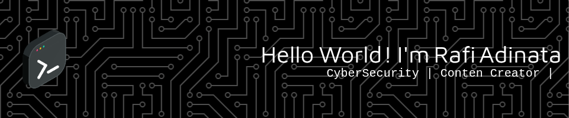

## Hello World! I'm Rafi Adinata 👋

# 💫 About Me:

🌱 I’m currently learning **CyberSecurity** — bidang yang paling cocok dan sesuai dengan jiwaku.  
💻 Passionate about Hacking, Intelligence, and Digital Ops.  
🔥 Building tools for OSINT, Cyber Defense, and Red Team Simulation.  
🛠️ Working with Python, Bash, Flutter, and Linux systems.  
📍 Based in Yogyakarta, Indonesia 🇮🇩  
📫 Reach me: [LinkedIn](https://linkedin.com/in/rafi-adinata-rachmat-b754ab259) | [Email](mailto:rafiadinata@gmail.com)

> 💬 _"Code like a hacker. Think like an intel officer. Move like a ghost."_

## 🌐 Socials:

  
  

# 💻 Tech Stack:

  
  
  
  
  

## 🔐 Platforms & Tools

  

# 📊 GitHub Stats:

 
 

## 🏆 GitHub Trophies

### 🔝 Top Contributed Repo

---

<!-- Proudly created with GPRM ( https://gprm.itsvg.in ) -->

### OS

## 🎮 Play Game With Me

<picture>
  <source media="(prefers-color-scheme: dark)" srcset="https://raw.githubusercontent.com/RaviAdinata/RaviAdinata/output/pacman-contribution-graph-dark.svg">
  <source media="(prefers-color-scheme: light)" srcset="https://raw.githubusercontent.com/RaviAdinata/RaviAdinata/output/pacman-contribution-graph.svg">
  
</picture>

###

###
